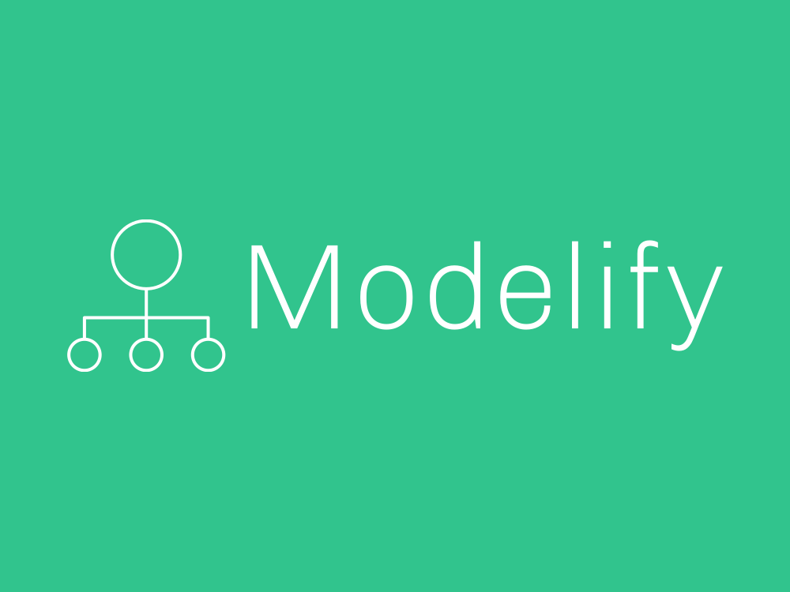

# Modelify: Simplifying Django Model Creation

`Modelify` is a user-friendly web tool designed to streamline the creation and building process of model.py files in Django applications. This tool features a simple web interface that utilizes `JavaScript` to generate Django model code effortlessly.

# Features/Project Roadmap

- [X] Generate basic code to `classes` and `fields`
- [ ] Implement error checking for empty or invalid fields/options

# Getting Started

To access Modelify and start creating your Django models, [visit the Modelify Webpage.](https://anthhon.github.io/Modelify/)

### How to Use Modelify

- Create a New Class:
- Click on the "New Class" button to initiate the creation of a new class.
- Enter the class name when prompted. Ensure it is unique and meaningful.

### Add Fields:

- Click the "New Field" button within the class section to add fields to your class.
- Specify the field name, type, size (if applicable), default value, and other properties as needed.
- For Foreign Key relationships, select the related class from the dropdown menu.

### Delete Classes or Fields:

- To remove a class or field, click the trash icon next to the class or field you want to delete.
- 
### Generate Django Model Code:

- Once you have defined your classes and fields, click the "Generate Models" button.
- The generated Django model code will be displayed in the code section below.

# Example generated code:

```python
class Products(models.Model):
    name = models.CharField(max_length=64, primary_key=False, null=False, blank=False, unique=True)

    models.ForeignKey(ProductsTypes, on_delete=models.CASCADE, primary_key=False, null=False, blank=False, unique=False)

    def __str__(self):
        return self.Products

class ProductsTypes(models.Model):
    type = models.CharField(max_length=32, primary_key=False, null=False, blank=False, unique=True)

    def __str__(self):
        return self.ProductsTypes

```

# License 

This program is distributed under the MIT License. See the [LICENSE](./LICENSE) file for more details.

Feel free to customize the documentation further based on your project's specific requirements and audience. Let me know if you need more assistance!
